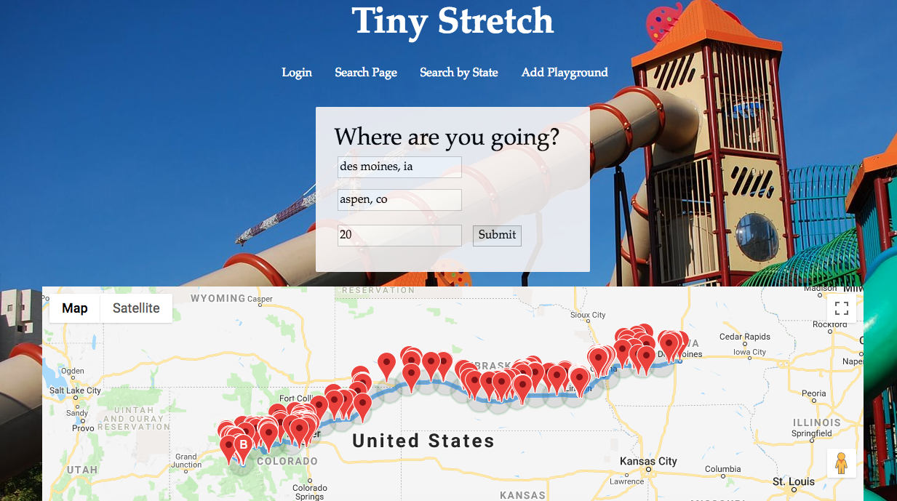

## Tiny Stretch

[Tiny Stretch](https://tiny-stretch.herokuapp.com/) is a web-based application for finding playgrounds and parks along a driving route. The purpose is to make road trips more enjoyable for children, and more tolerable for parents of said children.  A visitor can input their starting and ending destinations, and be shown not only the quickest route (as supplied by Google Maps), but also the locations of parks and playgrounds along the way. Moreover, each search updates the database so as to create a directory of playgrounds, which is searchable by state. Users have the capability of adding park reviews and adding new playgrounds directly.

